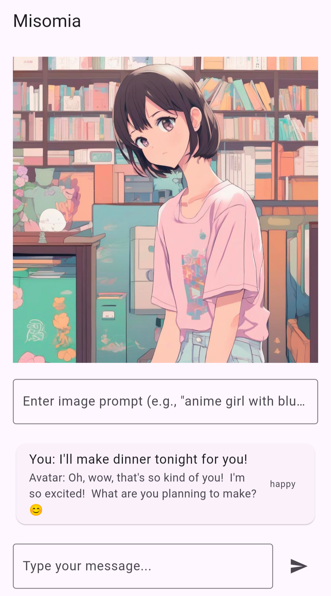
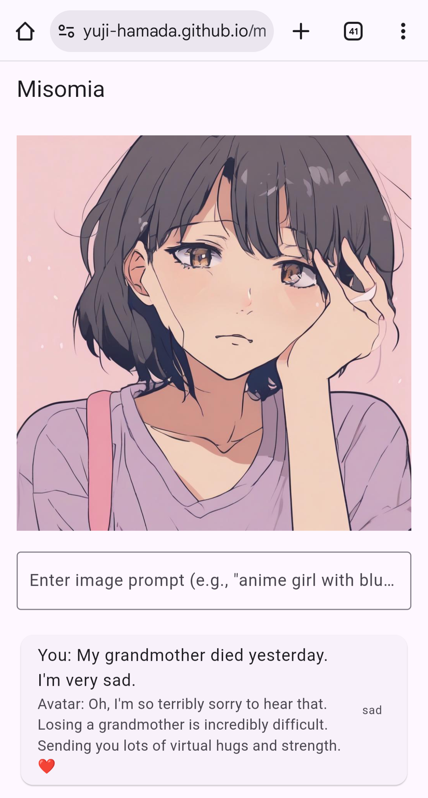
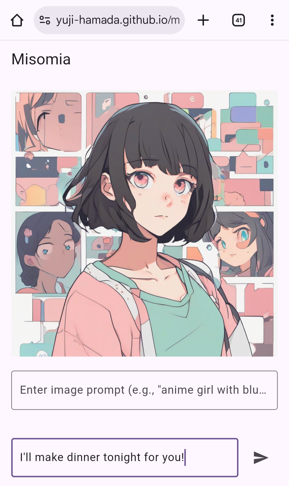

# Misomia

Misomia is a Flutter app featuring an AI avatar that visually expresses emotions. It analyzes chat messages via Gemini API, generating anime-style faces with Hugging Face AI. Securely proxies all API keys via Google Cloud Functions, ensuring client-side security. Experience dynamic, empathetic visual and text interaction.

## Features

*   **Human-Centered AI Avatar:** An AI character that responds visually and textually.
*   **Emotion Detection:** Analyzes chat messages to understand emotional tone (via Gemini API).
*   **Generative Replies:** AI-powered conversational responses (via Gemini API).
*   **Dynamic Image Generation:** Creates unique anime-style avatar images based on emotion and custom prompts (via Hugging Face Inference API).
*   **Secure API Handling:** All sensitive API keys are proxied through Google Cloud Functions, never exposed client-side.
*   **Responsive Web App:** Built with Flutter for cross-platform compatibility.

## Setup and Installation

1.  **Clone the repository:**
    ```bash
    git clone https://github.com/Yuji-HAMADA/misomia.git
    cd misomia
    ```
2.  **Install Flutter dependencies:**
    ```bash
    flutter pub get
    ```
3.  **Set up Google Cloud Functions for API Proxying:**
    *   Follow the instructions to deploy three Cloud Functions:
        *   `gemini-emotion-proxy` (for emotion detection)
        *   `gemini-reply-proxy` (for AI replies)
        *   `hf-image-proxy` (for image generation)
    *   Ensure your Gemini API key and Hugging Face API key are set as environment variables in the respective Cloud Functions during deployment.
    *   Update the URLs in `lib/emotion_service.dart`, `lib/reply_service.dart`, and `lib/image_generation_service.dart` to point to your deployed Cloud Function URLs.
4.  **Run the Flutter app:**
    ```bash
    flutter run -d chrome # For web
    # or for other platforms
    flutter run
    ```

## Usage

Type your messages in the chat input. The avatar will detect your emotion, generate a reply, and update its facial expression with a newly generated anime image. You can also provide a custom image prompt.

## Sample Images

<p align="center">
  
  
  
</p>

*A sample image of the avatar expressing happiness.*
*A sample image of the avatar expressing sadness.*
*A screenshot of the Misomia app interface.*

---

**Note:** Image generation can take several seconds depending on the API service and model.
Free tiers may have usage limits.